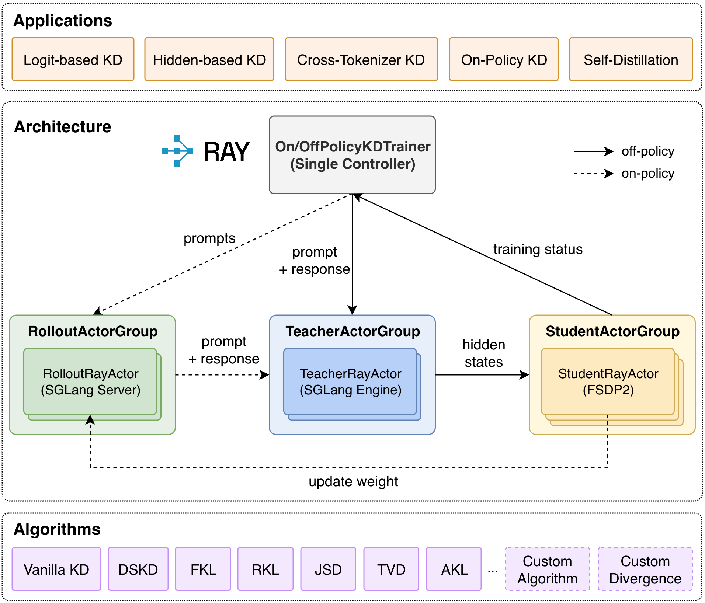
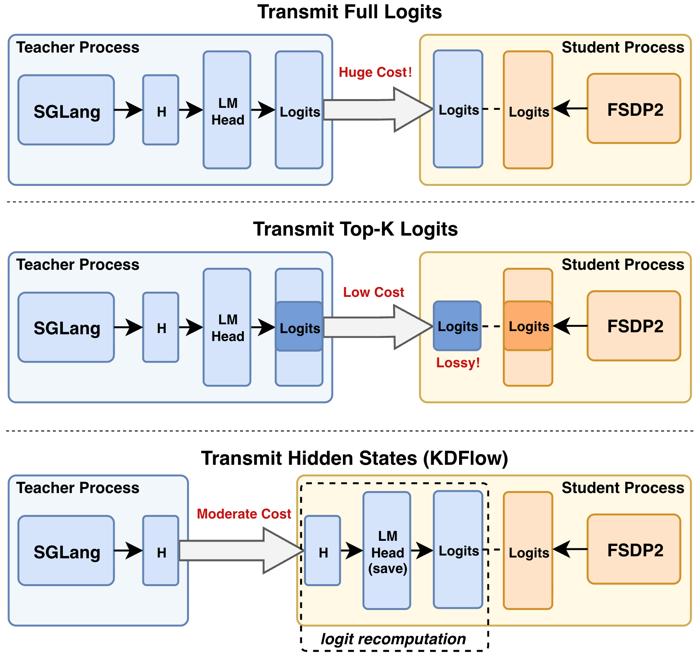

# KDFlow

**KDFlow** is a user-friendly and efficient knowledge distillation framework for large language models (LLMs), built on top of **Ray**, **FSDP2**, and **SGLang**. It supports both **off-policy** and **on-policy** knowledge distillation, enabling efficient transfer of knowledge from a large teacher model to a smaller student model.

<p align="left">
  📄 <a href="https://arxiv.org/pdf/2603.01875">Paper (arXiv)</a>
</p>

---

## ✨ Key Features

- **Decoupled Infrastructure** - Using SGLang & FSDP2 for teacher inference and student training respectively.
- **Off-Policy Knowledge Distillation** — Distill from pre-collected teacher hidden states on static datasets.
- **On-Policy Knowledge Distillation** — Student-generated rollout responses are used for teacher forward and distillation training in a closed loop.
- **Cross-Tokenizer Distillation** — Native support for distilling between models with different tokenizers (e.g., Llama → Qwen).
- **SFT Training (Black-box KD)** — Supervised fine-tuning on collected dataset.
- **Colocate Mode** — Teacher and student models **share the same GPUs** via sleep/wakeup mechanism, maximizing GPU utilization.
- **Teacher on SGLang** — Teacher inference is powered by SGLang Engine, enabling high-throughput prefilling and flexible parallel strategies.
- **Pluggable KD Algorithms** — Built-in support for Vanilla KD and DSKD (Dual-Space Knowledge Distillation), with easy registration of custom algorithms.
- **Multiple Loss Functions** — Torch compiled KL divergence, Reverse KL divergence, JS divergence, etc.
- **LoRA Support** — Optional LoRA fine-tuning for the student model.
- **Wand&b Integration** — Built-in wand&b logging for experiment tracking.
- **High Training Efficiency** — Achieves **1.4x to 6x** faster distillation compared to mainstream knowledge distillation frameworks.

---

## 📐 Architecture Overview

<p align="center">
  
</p>

### Training Modes

#### Off-Policy KD

```
Data → Teacher Forward (SGLang) → Hidden States → Student Train (FSDP2)
       [sleep/wakeup GPU sharing]
```

1. Load static SFT dataset with prompt-response pairs.
2. Teacher performs prefilling via SGLang to extract hidden states.
3. Hidden states are transferred to student via shared memory.
4. Student computes KD loss using teacher's lm_head + hidden states and updates.

#### On-Policy KD

```
Prompts → Rollout (SGLang) → Responses → Teacher Forward → Hidden States → Student Train
          [weight sync from student]
```

1. Student generates responses via SGLang rollout engines.
2. Teacher prefills the generated sequences to extract hidden states.
3. Student trains on the on-policy data with KD loss.
4. Student weights are synced back to rollout engines via Gloo IPC.

---

## 🚀 Quick Start

### Installation

```bash
git clone https://github.com/songmzhang/KDFlow.git
cd KDFlow
pip install -e ./
```

### Off-Policy Knowledge Distillation

```bash
bash ./examples/off_policy_kd/run_qwen3_30b_a3b_to_4b.sh
```

### On-Policy Knowledge Distillation

```bash
bash ./examples/on_policy_kd/run_qwen3_30b_a3b_to_4b.sh
```

### Supervised Fine-Tuning (SFT)

```bash
bash ./examples/sft/run_qwen3_4b.sh
```

---

## ⚙️ Configuration Reference

### Model Arguments

| Argument | Default | Description |
|---|---|---|
| `--student_name_or_path` | `None` | Student model name or path |
| `--teacher_name_or_path` | `None` | Teacher model name or path |
| `--attn_implementation` | `flash_attention_2` | Attention implementation |
| `--use_liger_kernel` | `False` | Use Liger Kernel for teacher model |
| `--lora_rank` | `0` | LoRA rank (0 = disabled) |
| `--lora_alpha` | `16` | LoRA alpha |
| `--ring_attn_size` | `1` | Ring attention group size |
| `--enable_thinking` | `False` | Enable thinking mode |

### Training Arguments

| Argument | Default | Description |
|---|---|---|
| `--num_nodes` | `1` | Number of training nodes |
| `--num_gpus_per_node` | `8` | GPUs per node |
| `--num_epochs` | `1` | Number of training epochs |
| `--train_batch_size` | `128` | Global training batch size |
| `--micro_train_batch_size` | `1` | Per-GPU micro batch size |
| `--learning_rate` | `1e-6` | Learning rate |
| `--lr_scheduler` | `cosine_with_min_lr` | LR scheduler type |
| `--lr_warmup_ratio` | `0.05` | Warmup ratio |
| `--max_norm` | `1.0` | Gradient clipping max norm |
| `--backend` | `fsdp2` | Training backend |
| `--gradient_checkpointing` | `False` | Enable gradient checkpointing |
| `--save_path` | `./ckpt/` | Model save path |

### Distillation Arguments

| Argument | Default | Description |
|---|---|---|
| `--kd_ratio` | `0.5` | KD loss weight: `loss = (1 - kd_ratio) * CE + kd_ratio * KD` |
| `--kd_temperature` | `1.0` | Temperature for softmax in KD |
| `--kd_algorithm` | `vanilla_kd` | KD algorithm (`vanilla_kd` / `dskd`) |
| `--kd_loss_fn` | `kl` | Divergence function (like `kl` / `rkl` / `jsd`) |
| `--teacher_tp_size` | `8` | Teacher tensor parallel size |
| `--teacher_ep_size` | `1` | Teacher expert parallel size |
| `--teacher_pp_size` | `1` | Teacher pipeline parallel size |
| `--teacher_dp_size` | `1` | Teacher data parallel size |
| `--teacher_enable_sleep` | `False` | Enable teacher sleep/wakeup for GPU sharing |
| `--teacher_forward_n_batches` | `1` | Teacher forward N batches at once |
| `--teacher_mem_fraction_static` | `0.4` | SGLang static memory fraction for teacher |

### Rollout Arguments (On-Policy)

| Argument | Default | Description |
|---|---|---|
| `--rollout_num_engines` | `4` | Number of SGLang rollout engines |
| `--rollout_tp_size` | `2` | Tensor parallel per rollout engine |
| `--rollout_batch_size` | `32` | Prompts per rollout iteration |
| `--n_samples_per_prompt` | `1` | Number of responses per prompt |
| `--generate_max_len` | `2048` | Max generation length |
| `--temperature` | `1.0` | Sampling temperature |
| `--top_p` | `1.0` | Top-p sampling |
| `--rollout_enable_sleep` | `False` | Enable rollout sleep/wakeup |

### Data Arguments

| Argument | Default | Description |
|---|---|---|
| `--train_dataset_path` | `None` | Training dataset path |
| `--max_len` | `None` | Max sequence length |
| `--input_key` | `messages` | Dataset input key |
| `--apply_chat_template` | `True` | Apply tokenizer chat template |
| `--packing_samples` | `False` | Pack sequences for efficiency |
| `--use_dynamic_batch` | `False` | Dynamic batching by token count |

### Logging Arguments

| Argument | Default | Description |
|---|---|---|
| `--logging_steps` | `10` | Log every N steps |
| `--use_wandb` | `False` | Enable W&B logging |
| `--wandb_project` | `None` | W&B project name |
| `--wandb_run_name` | `None` | W&B run name |

---

## 🧩 Extending KDFlow

### Adding a Custom KD Algorithm

Create a new file in `kdflow/algorithms/` and register it:

```python
import torch
from kdflow.loss import LOSS_DICT
from kdflow.algorithms import register_algorithm


@register_algorithm("my_custom_kd")
class MyCustomKD:
    def __init__(self, strategy, student_model, teacher_lm_head, **kwargs):
        self.strategy = strategy
        self.student = student_model
        self.teacher_lm_head = teacher_lm_head
        self.loss_fn = LOSS_DICT[strategy.args.kd.loss_fn]

    def training_step(self, micro_batch):
        # Access student inputs
        student_input_ids = micro_batch["stu_input_ids"]
        student_attn_mask = micro_batch["stu_attn_mask"]
        student_loss_mask = micro_batch["stu_loss_mask"].bool()
        teacher_hiddens = micro_batch["teacher_hiddens"]
        avg_token_num = micro_batch["avg_micro_batch_token_num"]

        # Student forward
        output = self.student(student_input_ids, attention_mask=student_attn_mask, return_output=True)
        student_logits = output["logits"][student_loss_mask]

        # Teacher logits from hidden states + lm_head
        teacher_logits = self.teacher_lm_head(teacher_hiddens.to(self.teacher_lm_head.weight))

        # Compute your custom loss
        kd_loss = self.loss_fn(student_logits, teacher_logits, temperature=1.0)
        kd_loss = kd_loss.sum() / avg_token_num

        return {"loss": kd_loss, "kd_loss": kd_loss}
```

Then use it with `--kd_algorithm my_custom_kd`.

### Adding a Custom KD Loss

Create a new file in `kdflow/loss/` and register it:

```python
import torch
import torch.nn.functional as F 

from kdflow.loss import register_loss


@register_loss("my_custom_loss")
@torch.compile()
def compute_kl_div(
    student_logits,
    teacher_logits, 
    temperature=1.0,
    reduction="none",
    **kwargs
):
    student_logits = student_logits / temperature
    teacher_logits = teacher_logits / temperature
    log_probs = torch.log_softmax(student_logits, -1, dtype=torch.float32)
    target_probs = torch.softmax(teacher_logits, -1, dtype=torch.float32)
    kl_div = F.kl_div(log_probs, target_probs, reduction=reduction).sum(-1)
    
    return kl_div
```

Then use it with `--kd_loss_fn my_custom_loss`.

---

## 🔑 Design Highlights

### GPU Co-location via Sleep/Wakeup

KDFlow enables teacher and student to **share the same GPUs** through a sleep/wakeup mechanism:

1. **Teacher phase**: Teacher model weights are loaded on GPU, student optimizer states are offloaded to CPU.
2. **Student phase**: Student optimizer states are reloaded to GPU, teacher model weights are offloaded to CPU.

This allows running large teacher models (e.g., 200B+ parameters) on the same hardware as the student without requiring separate GPU pools.

### Hidden States Transfer via Shared Memory

<p align="center">
  
</p>

Instead of transferring full teacher logits (which can be enormous for large vocabularies), KDFlow:

1. Extracts **hidden states** from the teacher's last layer via SGLang.
2. Transfers them to the student via **shared memory** (zero-copy).
3. Computes teacher logits **on the student side** using only the teacher's `lm_head` weights.

This dramatically reduces memory and communication overhead.

### Token-Based Teacher Load Balancing

The `TeacherActorGroup` uses a **greedy token-based load balancing** strategy to distribute micro-batches across teacher actors, ensuring even workload distribution when sequence lengths vary.

---

## 🙏 Acknowledgement

KDFlow is built upon the shoulders of outstanding open-source projects. We sincerely thank:

- [OpenRLHF](https://github.com/OpenRLHF/OpenRLHF) — We gratefully adopt its well-designed abstractions for model wrapping and distributed training strategy, which form the foundation of our training infrastructure.
- [slime](https://github.com/THUDM/slime) — We appreciate its elegant implementation of Ray placement group initialization and the weight update mechanism for SGLang, which greatly inspired our design of on-policy distillation.

---

## 📖 Citation

If you find KDFlow useful in your research or work, please consider citing our paper:

```bibtex
@article{zhang2026kdflow,
      title={KDFlow: A User-Friendly and Efficient Knowledge Distillation Framework for Large Language Models}, 
      author={Songming Zhang and Xue Zhang and Tong Zhang and Bojie Hu and Yufeng Chen and Jinan Xu},
      year={2026},
      eprint={2603.01875},
      archivePrefix={arXiv},
      primaryClass={cs.CL},
      url={https://arxiv.org/abs/2603.01875}, 
}
```

---

## 📄 License

This project is licensed under the [MIT License](LICENSE).

---

## ⭐ Star History

[](https://www.star-history.com/#songmzhang/KDFlow&type=date&legend=top-left)
